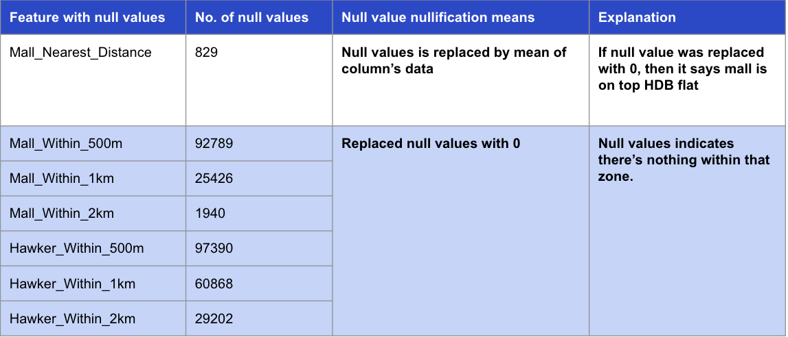

#  Project 2 - Singapore Housing Data and Kaggle Challenge

## Introduction

In Singapore, Housing and Development Board (HDB) flats are a vital component of the public housing landscape. These flats serve as affordable and accessible housing options for the majority of Singaporeans. HDB flats are not just places to live; they represent a significant part of the Singaporean identity. For many, buying an HDB flat is a milestone and a long-term investment.

## Problem Statement

Predicting the resale prices of HDB flats manually can be an error-prone task due to various factors such as the diverse range of flat types, locations, sizes etc. To make informed decisions in the real estate market, it is crucial to have accurate price predictions.

As a data-driven real estate agency, our team of data scientists has developed a cutting-edge machine learning model. This model provides precise and tailored insights to our clients, ensuring they make informed decisions aligned with their financial preferences.

## Datasets

Source: https://www.kaggle.com/competitions/dsi-sg-project-2-regression-challenge-hdb-price/data

* train.csv: 150,534 rows, 78 columns; contains train data with 77 features (flat type, location, floor area etc.) and the resale prices
* test.csv: 16737 rows, 77 columns; contains test data with the same 77 features

## Data Preprocessing

- Discuss the steps you took to clean and preprocess the data.
- Explain how missing values, outliers, and categorical variables were handled.
- Provide code snippets or references to relevant data preprocessing scripts.

## Exploratory Data Analysis (EDA)

- Share visualizations and insights from the exploratory data analysis.
- Highlight any patterns, correlations, or interesting findings in the data.

## Model Development

- Describe the machine learning models and algorithms used for predicting resale prices.
- Explain the model evaluation criteria, such as mean squared error (MSE), root mean squared error (RMSE), and R-squared (R^2).
- Share the results of model training and validation.

## Conclusion

In this project, we have leveraged machine learning to predict HDB flat resale prices accurately. Our goal is to empower buyers with valuable insights and recommendations, enabling them to make informed decisions based on their budget and expected return on investment. As real estate agents, we are committed to providing our clients with data-driven advice to guide them through the complex Singaporean real estate market.

For any inquiries or assistance related to HDB flat resale price predictions, please feel free to contact us.

**Note**: Customize this README template with specific details and results from your project. Include any additional sections or information that is relevant to your project's goals and findings.
